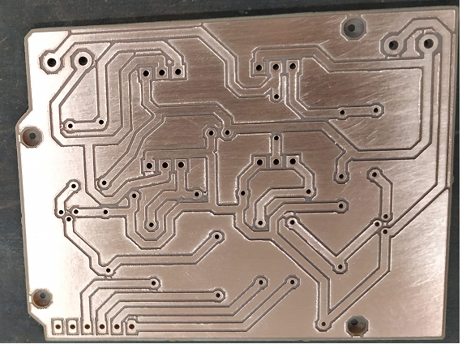
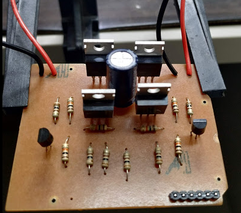

# TecProto

Projeto Shield Ponte H

> Simulação do circuito ponte H no proteus: https://youtu.be/N4v_dAQ7tW8

> Teste funcional do circuito ponte H: https://youtu.be/uUiPD2X1OSA

> Produção da placa: https://youtu.be/X5bCmTGeRY4 

> Placa de circuito do shield: 

> Montagem do circuito

